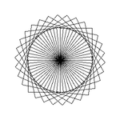

# turtle

This repository contains a trivial implementation of a turtle-graphics
thing.

We've embedded a simple [FORTH Interpreter](https:/github.com/skx/foth) and
we use that to allow the user to run scripts to control the standard turtle.

## Usage

Run the application with the path to a script:

      ./turtle ./foo.in

The generated output will be saved in `turtle.png`, and an animation will be saved alongside it as `turtle.gif`:

Rendered output of [_examples/grid.4th](_examples/grid.4th):

Animated output of [_examples/grid.4th](_examples/grid.4th), showing how it was created:

You can find example scripts beneath [_examples/](_examples/)

## Words

The following words are defined:

* `forward`
  * Pop one word from the stack, move that much forward.
* `move`
  * Pop two words off the stack, move to the specified coordinates
* `pen`
  * Pope one word from the stack, if 0 lift the pen, else lower it.
* `turn`
  * Pop one word from the stack, increase the movement direction by that many degrees.
* `direction`
  * Pop one word from the stack, set the direction to that value.

# Github Setup

This repository is configured to run tests upon every commit, and when pull-requests are created/updated.  The testing is carried out via [.github/run-tests.sh](.github/run-tests.sh) which is used by the [github-action-tester](https://github.com/skx/github-action-tester) action.
